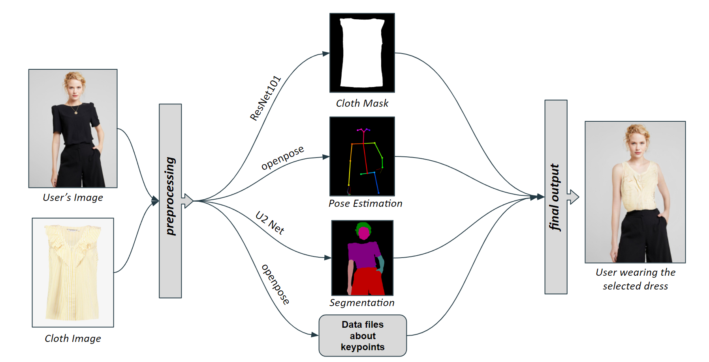
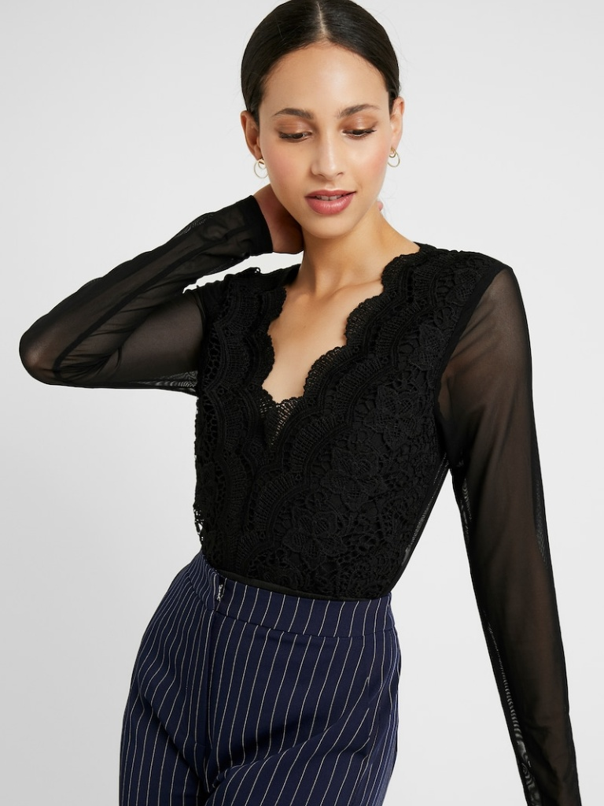
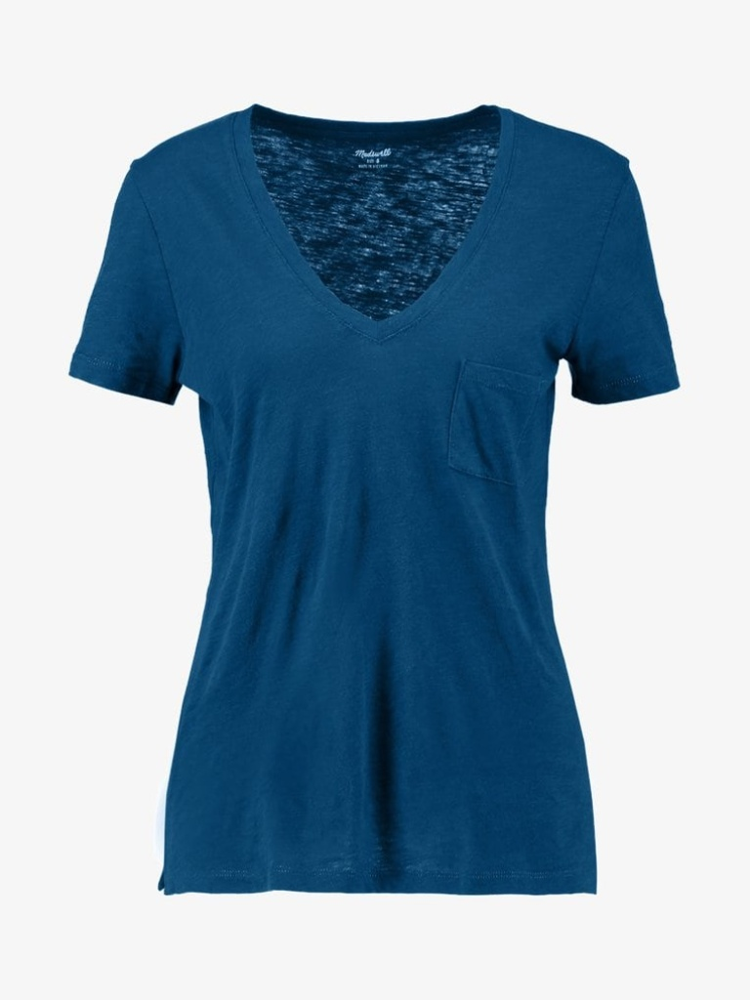
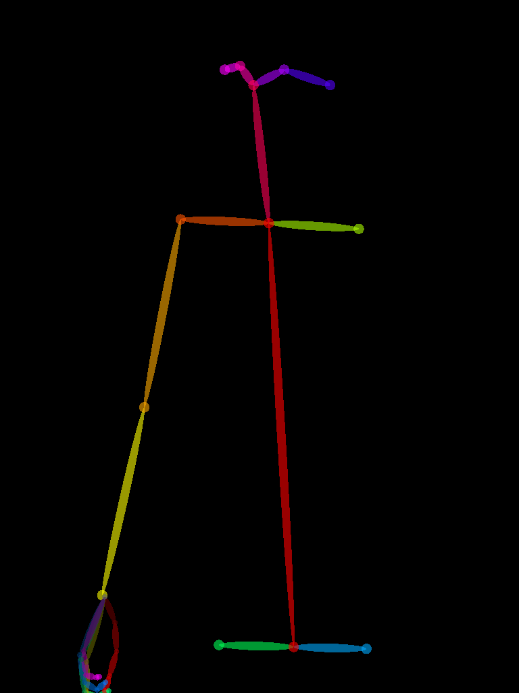
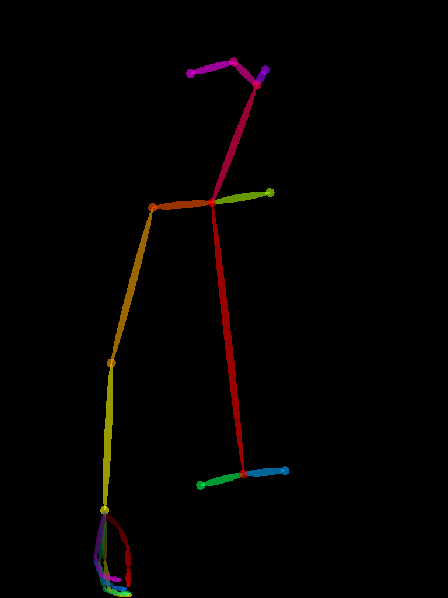
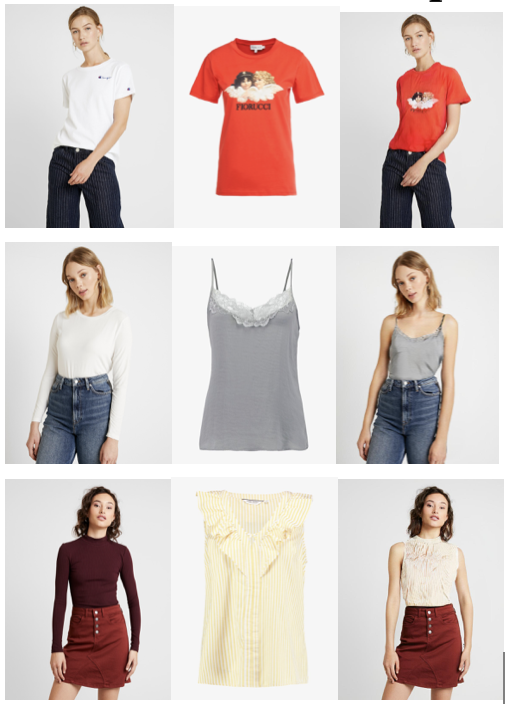
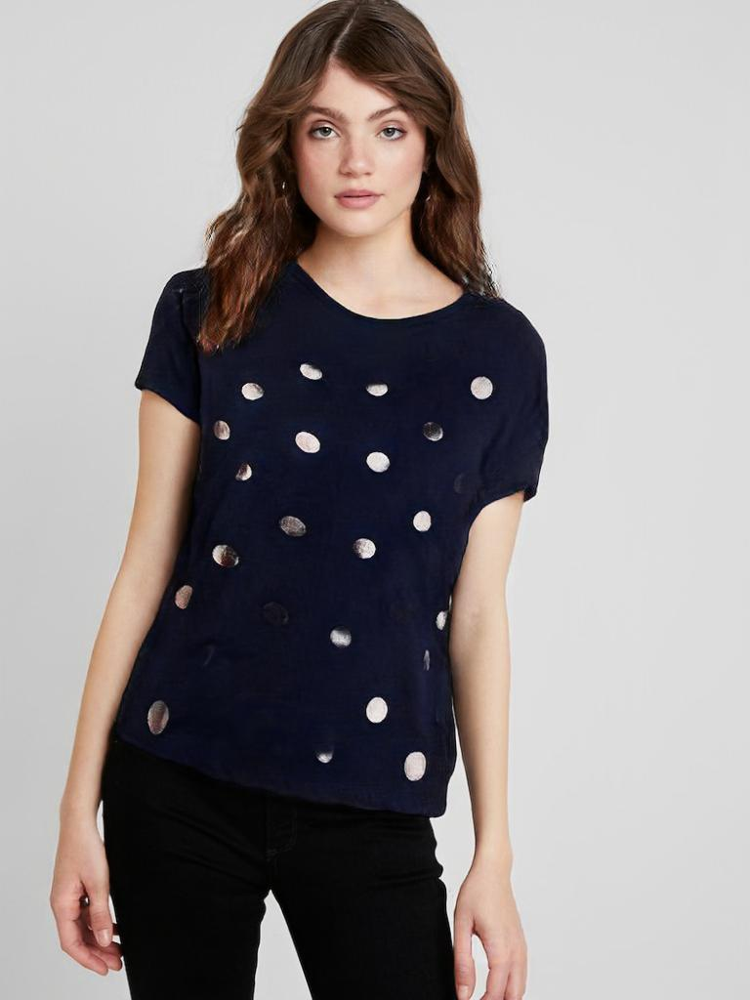
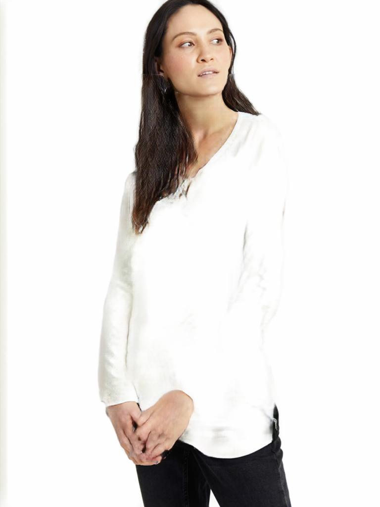
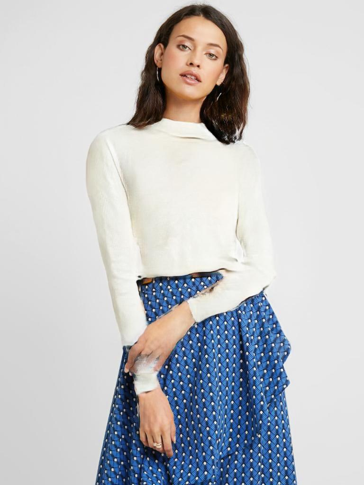
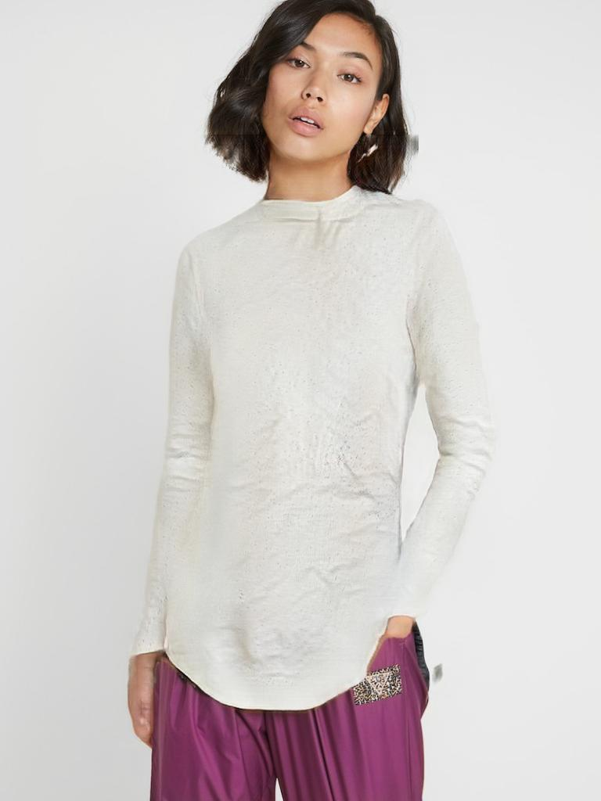

# VTON : A 2D Virtual Try-On (DS5500 : Data Science Capstone Project)

## Author: Dilshath Shaik

## Abstract:

In this project, we explore the rapidly growing field of virtual try-on technology, which has become increasingly important with the rise of online shopping. Our approach introduces a new method that overcomes some of the typical challenges faced by current technologies, such as limited resolution and inaccuracies in how clothing fits onto a user's digital avatar. By using advanced image synthesis and deep learning models, our system can create high-resolution, realistic simulations of how different outfits will look on a person. We focused on ensuring that the clothing aligns accurately with the wearer’s body and pose, and that the fabric's texture and flow are realistically depicted. Our results show a clear improvement over existing methods, offering sharper images and more precise garment fitting. This project not only enhances the online shopping experience but also paves the way for future advancements in the field of virtual apparel trials.

## Introduction:

The digital transformation of the retail industry has been markedly accelerated by advancements in technology, particularly in the realm of e-commerce. Among the most promising developments in this field is virtual try-on technology, which allows consumers to visualize themselves in clothing through digital platforms before making a purchase. This innovation not only enhances the online shopping experience but also aims to reduce return rates caused by sizing issues or unmet expectations regarding fit and style.

The concept of virtual try-on systems is not new; however, traditional methods have struggled with issues such as low resolution, poor alignment of clothing with the user’s body, and unrealistic rendering of fabric properties. These limitations can detract from the user experience and fail to convincingly simulate the physical try-on experience.

In response to these challenges, our project introduces an advanced approach using deep learning techniques and image synthesis to create high-resolution, accurate representations of how clothes fit on a person’s digital avatar. Our method leverages state-of-the-art models in semantic segmentation, geometric matching, and texture rendering to ensure that the digital garments adhere closely to the user’s body contours and movements, and that the fabric’s dynamics are realistically portrayed.

This introduction sets the stage for a detailed discussion on our innovative solution, its implementation, and the tangible benefits it offers to both consumers and retailers in the e-commerce landscape.

## Methods:

The methodology unfolds in four major stages, as described below:

### Pre-processing:
The user's image I and its corresponding segmentation map S are processed to generate a clothing-agnostic version of the person's image I_a. This involves the removal of the clothing and arms from the image to prepare for the virtual try-on.
Simultaneously, the pose of the person P is estimated, which provides a skeletal framework that is crucial for aligning the new clothing item with the person's posture.

### Segmentation Generation:

The Segmentation Generator takes the pose map P and the clothing-agnostic person image I_a to synthesize a new segmentation map. This map predicts how the new garment will fit onto the person's body, segmenting the image into distinct regions like the torso, limbs, and the garment itself.

### Clothes Deformation:

The Geometric Matching Module (GMM) uses the clothing image c, the pose P, and the synthetic segmentation to warp the clothing item so that it aligns with the pose and body shape of the user. This step is critical to ensure that the garment conforms to the right contours and orientation of the person's figure.

### Try-On Synthesis:

In the final stage, the ALIAS Generator merges the deformed clothing with the user's clothing-agnostic image. It intelligently handles areas where the clothing item does not align perfectly with the body (M_misalign) to create a seamless composite.
The ALIAS Generator takes the inputs I_a ⊕ P ⊕ W(c, θ) (where W(c, θ) represents the warped clothing image) and synthesizes the final output image Ĩ. This output showcases the user wearing the selected outfit with realistic folds, shadows, and textures, as if the user is actually wearing the garment.

## Experimental Results(Evaluation):

As you have seen earlier, this project has a several steps before giving us the virtual tryon result. 

### Step -1 (Upload model image, cloth image)

 

### Step - 2(Converting these images into openpose-json, openpose-img)

I have taken the openpose-json[1] and then generated using the standard model images

 

### Step - 3(Segmentation, GMM, Alias) and then the final result

### Step -4(Best try-on images recorded so far):

 
 

To know about more results, please look at "results/final-results"

## Discussion (analysis):

The virtual try-on project is making it easier for people to see how clothes will look on them without actually having to wear them. This is really helpful for online shopping because you can get a good idea of the fit and style from your computer or phone. It works even if you’re not standing perfectly straight or if your hands are in your pockets, which is how people stand a lot of the time.

Anyone who shops for clothes online could find this really useful. It means less guessing about size and fit, so shoppers are more likely to be happy with what they buy and less likely to send things back. Online stores can sell more confidently, knowing their customers are getting what they expect.

This is just the beginning, though. In the future, we can make it even better, like making the clothes move more naturally or handling trickier poses. I've done most of the heavy lifting already, so now we can start using real pictures of people to make our virtual try-ons even more realistic.

## Statement of contributions:

I, Dilshath Shaik, hworked on the core development of this project. The insightful guidance provided by my professor, Jeongkyu Lee, was instrumental in refining the project's direction and focus. Additionally, the consistent support and specialized assistance from my teaching assistant, Ting Tang, were critical in overcoming the technical challenges encountered along the way. Each of these roles played a fundamental part in the project's progression towards its current state of accomplishment.

## Conclusion:

Our virtual try-on project is really breaking new ground. Imagine not having to stand like a mannequin to see if a shirt fits well online. We're tackling the tricky stuff—like when you're turning sideways, or even when your hands are tucked away or crossed. That's not something you see every day in online shopping, right?

In conclusion, the virtual try-on project is a significant leap forward in bridging the gap between the convenience of online shopping and the assurance of in-store fitting rooms. By successfully addressing common posture-related challenges, such as non-standard stances and various arm positions, the project offers a more dynamic and realistic fitting experience. This has the potential to enhance consumer confidence in online apparel purchases, reduce return rates, and transform the retail landscape.

Retailers and customers stand to gain considerable benefits as this technology promises a highly personalized shopping experience. The groundwork laid by the current project is robust, and with further testing and refinement using real-life images, the next stages of development are poised to refine the system's realism and interactivity.

Moving forward, there's exciting potential to enrich the technology with advanced simulations of fabric physics and interactive movements. This would allow for an even closer emulation of real-world try-on sessions. The journey from here involves continuous innovation and real-world application, paving the way for a more intuitive, sustainable, and customer-centric future in fashion retail. 

## References:

[1]. T. Simon, H. Joo, I. Matthews, and Y. Sheikh, "Hand Keypoint Detection in Single Images using Multiview Bootstrapping," arXiv preprint arXiv:1704.07809, 2017. 

[2]. Haoye Dong, Xiaodan Liang, Xiaohui Shen, Bochao Wang, Hanjiang Lai, Jia Zhu, Zhiting Hu, and Jian Yin. Towards multi-pose guided virtual try-on network. In Proc. of the IEEE international conference on computer vision (ICCV), pages 9026–9035, 2019.

[3]. Andrew Brock, Jeff Donahue, and Karen Simonyan. Large scale gan training for high fidelity natural image synthesis. In Proc. the International Conference on Learning Representations (ICLR), 2018.